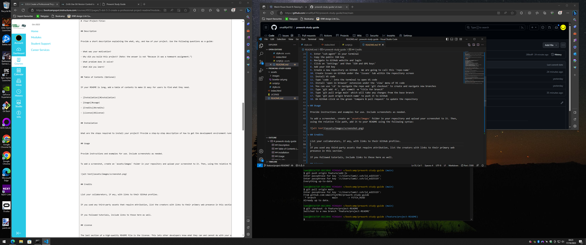

# prework-study-guide

## Description

Provide a short description explaining the what, why, and how of your project. Use the following questions as a guide:

- What was your motivation?
- Why did you build this project? (Note: the answer is not "Because it was a homework assignment.")
- What problem does it solve?
- What did you learn?

My motivation to build this project was to learn more about Git, Github, HTML, CSS, and JS so I will be prepared for my front-end web development course.

## Table of Contents (Optional)

If your README is long, add a table of contents to make it easy for users to find what they need.

- [Installation](#installation)
- [Usage](#usage)
- [Credits](#credits)
- [License](#license)

## Installation

1. Enter "ssh-keygen -t ed25519 -C 'your_email@example.com'" into your terminal
2. Save your key in the default file location and create a passphrase
3. Enter eval "$(ssh-agent -s)" in your terminal
4. Enter "ssh-agent" in your terminal
5. Copy the public SSH key
6. Navigate to GitHub website and login
7. Click on 'Settings' and then 'SSH and GPG keys'
8. Add your SSH key
9. Create a new repository on GitHub - We are going to call this 'repo-name'
10. Create issues on GitHub under the 'issues' tab within the repository screen
11. Install VS code
12. Type 'code .' into the terminal to open VS code
13. Install 'open in browser' extension under the 'view' menu of VS code
14. You can use 'cd' to navigate the repo and 'git checkout' to create and navigate new branches
15. Type 'git add -A', 'git commit -m "title for branch"
16. Type 'git pull orign main' which will take any changes from the base branch
17. Type 'git push origin branch-name' to push it to GitHub
18. On GitHub click on the green 'Compare & pull request' to update the repository

## Usage

Provide instructions and examples for use. Include screenshots as needed.

To add a screenshot, create an `assets/images` folder in your repository and upload your screenshot to it. Then, using the relative file path, add it to your README using the following syntax:

## Credits

List your collaborators, if any, with links to their GitHub profiles.

If you used any third-party assets that require attribution, list the creators with links to their primary web presence in this section.

If you followed tutorials, include links to those here as well.

## License

The last section of a high-quality README file is the license. This lets other developers know what they can and cannot do with your project. If you need help choosing a license, refer to [https://choosealicense.com/](https://choosealicense.com/).

---

🏆 The previous sections are the bare minimum, and your project will ultimately determine the content of this document. You might also want to consider adding the following sections.

## Badges

Badges aren't necessary, but they demonstrate street cred. Badges let other developers know that you know what you're doing. Check out the badges hosted by [shields.io](https://shields.io/). You may not understand what they all represent now, but you will in time.

## Features

If your project has a lot of features, list them here.

## How to Contribute

If you created an application or package and would like other developers to contribute to it, you can include guidelines for how to do so. The [Contributor Covenant](https://www.contributor-covenant.org/) is an industry standard, but you can always write your own if you'd prefer.

## Tests

Go the extra mile and write tests for your application. Then provide examples on how to run them here.